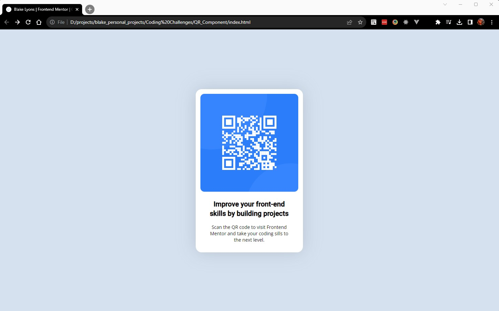

# Frontend Mentor - QR code component solution

This is a solution to the [QR code component challenge on Frontend Mentor](https://www.frontendmentor.io/challenges/qr-code-component-iux_sIO_H). Frontend Mentor challenges help you improve your coding skills by building realistic projects.

## Table of contents

-   [Overview](#overview)
    -   [Screenshot](#screenshot)
    -   [Links](#links)
-   [My process](#my-process)
    -   [Built with](#built-with)
    -   [What I learned](#what-i-learned)
    -   [Continued development](#continued-development)
    -   [Useful resources](#useful-resources)
-   [Author](#author)
-   [Acknowledgments](#acknowledgments)

**Note: Delete this note and update the table of contents based on what sections you keep.**

## Overview

### Screenshot

### Links

-   Solution URL: [Add solution URL here](https://github.com/blakelyons/code-challenges/tree/main/QR_Component)
-   Live Site URL: [Add live site URL here](https://blakelyons.com/graphics/coding_challenges/qr_code_component/index.html)

## My process

### Built with

-   Semantic HTML5 markup
-   CSS custom properties & variables
-   Flexbox
-   Mobile-first workflow
-   [Material Design Iconic Font](https://zavoloklom.github.io/material-design-iconic-font/icons.html)

### What I learned

I didn't learn anything new working on this project. This was the first Code Challenge to go through the process of submitting a challenge.

### Useful resources

-   No resources were used for this project.

## Author

-   Website - [www.blakelyons.com](https://www.blakelyons.com)
-   Frontend Mentor - [@yourusername](https://www.frontendmentor.io/profile/yourusername)
-   Twitter - [@blakelyons](https://www.twitter.com/blakelyons)

## Acknowledgments

I'd like to thank the internet for letting me know about Frontend Mentor.
